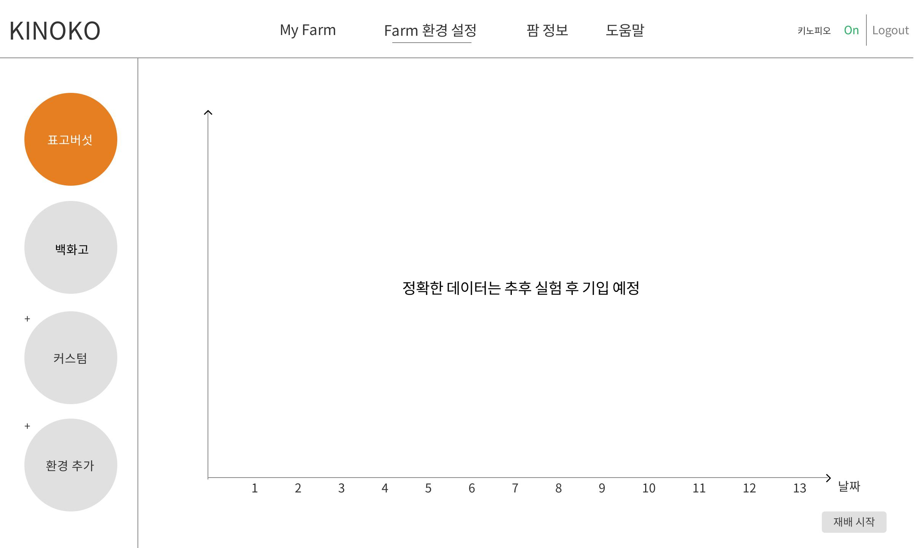
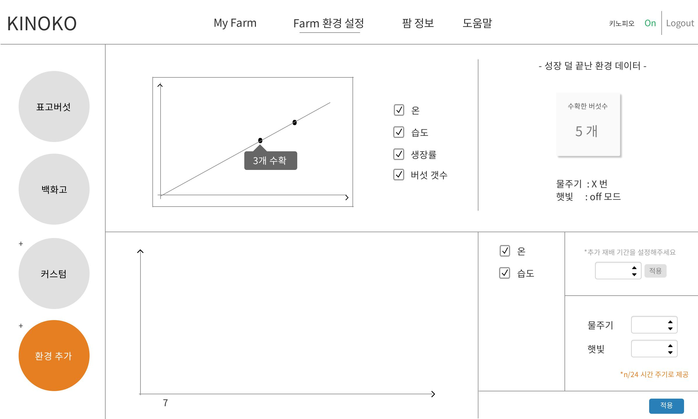

# マッシュマッシュ（Front-end）

## 担当パート
- ウェブに出るすべてのチャートの実装
- 環境設定ページ
-----

## 使用技術

    const javaScript = {
	    library: [
		    "React",
		    "chart.js",
		    "amcharts4"
	    ],
	    grammar: "ES6"
    };
  
 --- 
## ワイヤーフレーム

##  実装画面

update soon..
